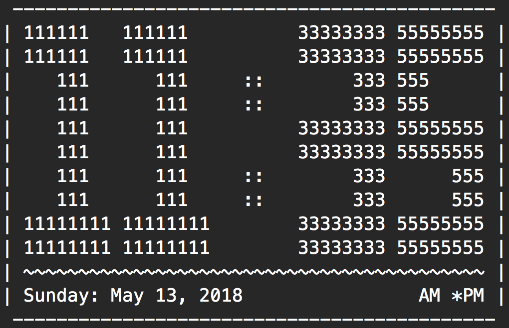

# A simple command line application, written in Rust, that prints the time to the console using ASCII art.

* The only purpose of this project was to help me learn the basics of Rust.
* I'm not personally a fan of all the styles and formatting used in this project (such as the Kernighan & Ritchie style of brace position and others), but I followed the preferred styles as mentioned in the official [Rust Language Book](https://doc.rust-lang.org/book/second-edition/index.html).  If you want to see my styling preferences, check any of my recent C++ projects.
* Special thanks to the members over in the [Rust live chat forum](https://client00.chat.mibbit.com/?server=irc.mozilla.org&channel=%23rust) for helping me through some Rust compiler errors.

